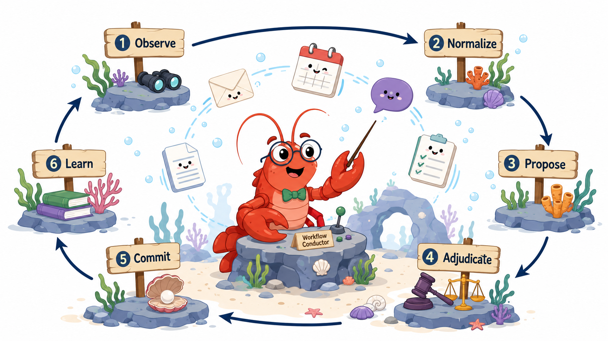
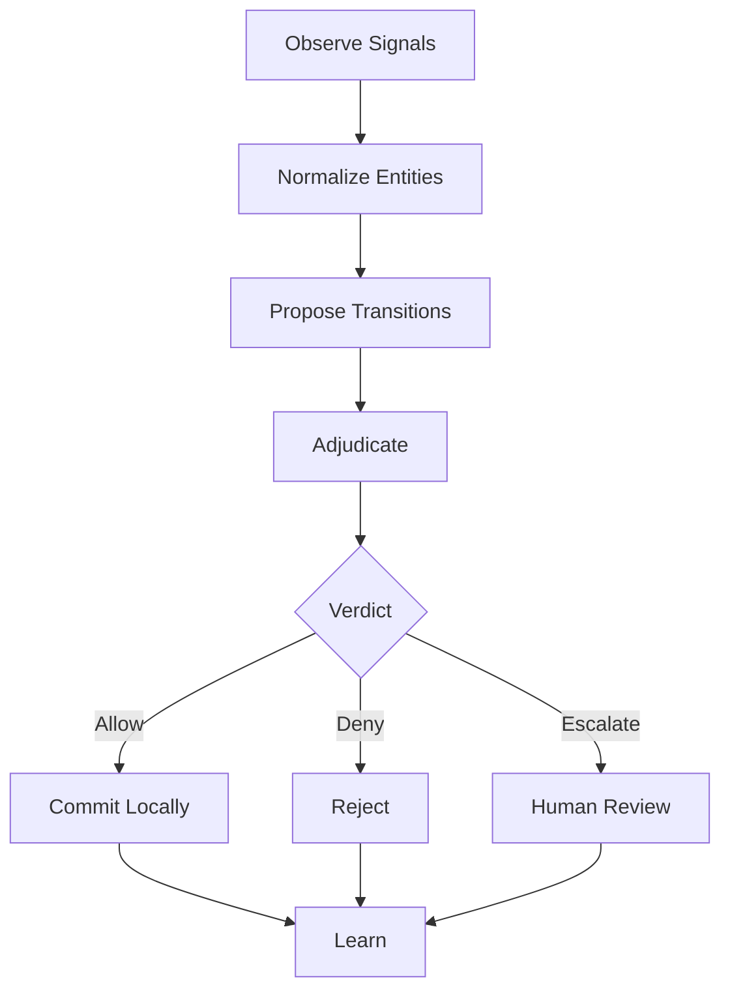

# WorldLoops

<p align="center">
  
</p>

Agents don't need more tools.\
They need a world to act in.

Because uncontrolled agents are too risky, and supervised agents make humans the bottleneck.

WorldLoops is an executable world layer for OpenClaw that turns scattered work signals into governed state transitions.

It observes signals from tools like Gmail, Calendar, and Slack, detects unresolved open loops, proposes what should happen next, and keeps execution safe with `externalWrite: false`.

WorldLoops is not a chatbot.\
It is not a todo app.\
It is not another trigger-based automation.

It is a small world model for agentic work execution.

From scattered signals to governed execution.

---

## Status

| Item | Status |
|---|---|
| Public ClawHub skill | ✓ |
| Latest release | `v0.2.7` |
| Clean install tested | ✓ |
| Gmail live validation | passed |
| Google Calendar live validation | passed |
| Slack live validation | passed |
| `externalWrite: false` confirmed | ✓ |
| Safe-by-default execution posture | ✓ |
| Open-loop detector blind spot fix | ✓ v0.2.6 |
| Notification preference runtime | ✓ v0.2.7 |
| Proactive discovery runtime (local) | ✓ v0.2.7 |
| Scheduled daily brief (local) | ✓ v0.2.7 |

---

## Why WorldLoops Exists

Most agents are tool-first. They can call APIs, summarize messages, draft replies, and trigger workflows. But real work does not happen as isolated tool calls.

Real work lives across emails, calendars, Slack messages, project updates, approvals, delays, promises, missing responses, and unresolved decisions. That is where open loops appear.

| | |
|---|---|
| Traditional automation | sees events |
| WorldLoops | sees state |
| Traditional agents | call tools |
| WorldLoops | proposes transitions |
| Traditional workflows | execute |
| WorldLoops | adjudicates before commit |

---

## The Agent Trust Gap

Today's agents are trapped between two bad options.

Give them write access, and they may act too freely.

Turn write access off, and they become passive copilots that need a human sitting beside them.

That is not autonomy. That is supervision at machine speed. The agent never gets tired. The human does.

This is the agent trust gap.

WorldLoops exists to close that gap.

It separates reasoning from execution, proposal from commit, and approval from external action.

Agents can keep working across signals, loops, and responsibilities. Humans stay in control without becoming the bottleneck. And external writes remain disabled by default with `externalWrite: false`.

The goal is not to make agents powerless.\
The goal is to make agent execution governable.

---

## Promptless by Design

Most assistants wait for a question. WorldLoops watches the world.

WorldLoops is not designed to wait for the user to ask, "What did I miss?" It can inspect events, snapshots, and work signals as they arrive, then propose unresolved loops before the user manually asks.

A user prompt may start a brief. But the core unit of WorldLoops is not a prompt. It is a signal.

An email arrives. A Slack message creates an obligation. A calendar event implies preparation. A project update changes responsibility.

WorldLoops observes those signals, normalizes them into world entities, and proposes governed transitions.

The user does not need to discover every loop manually. WorldLoops makes the loop visible.

---

## Notification Preferences

> **Runtime MVP — v0.2.7**

WorldLoops stores notification preferences locally in `.worldloops/notification_prefs.json`. Users control time, frequency, severity thresholds, and quiet hours.

```bash
# Create default preferences file
npm run notifications:init

# View current preferences
npm run notifications:show

# Set a preference by dot-path
npm run notifications:set -- dailyBrief.time 09:00
npm run notifications:set -- proactiveDiscovery.scanIntervalMinutes 60
npm run notifications:set -- proactiveDiscovery.minSeverity high
npm run notifications:set -- quietHours.enabled true
npm run notifications:set -- quietHours.start 21:00
npm run notifications:set -- quietHours.end 08:00
```

Supported preference fields:

| Field | Default | Description |
|---|---|---|
| `dailyBrief.enabled` | `true` | Enable daily brief |
| `dailyBrief.time` | `09:00` | Scheduled brief time (HH:MM) |
| `dailyBrief.timezone` | `UTC` | Timezone label |
| `proactiveDiscovery.enabled` | `false` | Enable proactive discovery |
| `proactiveDiscovery.scanIntervalMinutes` | `30` | Scan interval in minutes |
| `proactiveDiscovery.minSeverity` | `medium` | Minimum severity to surface |
| `quietHours.enabled` | `false` | Enable quiet hours |
| `quietHours.start` | `21:00` | Quiet period start |
| `quietHours.end` | `08:00` | Quiet period end |
| `eventAlerts.enabled` | `false` | Enable event alerts |
| `channels.cli` | `true` | CLI output channel |

This release does not auto-install background scheduling. Users may connect `brief:daily` to cron or launchd manually if they choose.

---

## Proactive Discovery

> **Runtime MVP — v0.2.7**

`discovery:run` reads notification preferences and surfaces only candidates that match the configured severity threshold. It applies duplicate suppression using `.worldloops/notification_state.json` to prevent repeated surfacing of the same candidate across runs.

```bash
npm run discovery:run -- \
  --gmail-event scripts/fixtures/openclaw-gmail-webhook.json \
  --gog-gmail scripts/fixtures/gog-gmail-messages.json
```

When a signal arrives, WorldLoops inspects it for unresolved state and surfaces open-loop candidates proactively. Each candidate is presented with suggested actions:

- **Review** — inspect the candidate and decide
- **Snooze** — defer for a set period
- **Dismiss** — mark as not actionable
- **Mark handled** — record that the loop was resolved

Safe-by-default: no external writes. Proactive discovery proposes — it does not act.

---

## Scheduled Daily Brief

> **Runtime MVP — v0.2.7**

`brief:daily` reads notification preferences and produces a daily brief output. It respects quiet hours and outputs JSON with `safety.externalWrite=false`.

```bash
npm run brief:daily -- \
  --gmail-event scripts/fixtures/openclaw-gmail-webhook.json \
  --calendar-event scripts/fixtures/openclaw-calendar-events.json
```

A daily brief includes:

- important open loops requiring action
- uncertain threads needing inspection
- upcoming meetings and preparation items
- required user decisions
- signals that arrived since the last brief

High-severity candidates can be surfaced before the scheduled brief time by running `discovery:run` separately. Quiet hours suppress non-critical notifications.

The brief is a proposal, not an execution. No external writes. User approval is required for any resulting action.

**Connecting to a schedule (optional):** This release does not auto-install cron or launchd. To run the daily brief automatically, add an entry to your crontab:

```
0 9 * * * cd ~/.openclaw/workspace/skills/worldloops && npm run brief:daily >> ~/.worldloops/brief.log 2>&1
```

To run a brief manually right now (using the reconcile API flow):

```bash
npm run brief:reconcile -- \
  --gmail-event scripts/fixtures/openclaw-gmail-webhook.json \
  --calendar-event scripts/fixtures/openclaw-calendar-events.json
```

---

## What Is an Open Loop?

An open loop is a work signal that implies unfinished responsibility. It is not just a task. It is a state that has not been resolved.

Examples:

- an email that requires a reply
- a Slack message asking someone to review something
- a meeting that implies preparation
- a GitHub pull request waiting for decision
- a project update that creates follow-up work
- a commitment made in one app but not reflected anywhere else

WorldLoops detects these loops, groups related signals, and proposes what should happen next.

---

## What WorldLoops Does

```
Observe → Normalize → Propose → Adjudicate → Commit → Learn
```

WorldLoops can:

- observe work signals from connected sources
- normalize scattered signals into consistent entities
- detect unresolved open loops
- group related signals across tools
- propose state transitions
- separate approval from execution
- produce safe action plans
- keep external writes disabled by default
- preserve an audit trail of what was proposed, approved, rejected, or deferred

WorldLoops does not ask an agent to "just do things." It gives the agent a world where actions can be proposed, judged, approved, committed, and audited.

---

## Install from ClawHub

WorldLoops is available as a public OpenClaw skill on ClawHub.

```
clawhub install worldloops
```

WorldLoops installs as a workspace skill:

```
~/.openclaw/workspace/skills/worldloops
```

This is expected. Bundled skills ship with OpenClaw itself. WorldLoops is a public ClawHub skill installed into your local OpenClaw workspace.

---

## Quick Start

Install and build:

```bash
npm install
npm run build
```

Run a reconciliation brief using included fixtures:

```bash
npm run brief:reconcile -- \
  --gmail-event scripts/fixtures/openclaw-gmail-webhook.json \
  --calendar-event scripts/fixtures/openclaw-calendar-events.json
```

Expected result:

- open loops detected
- related signals grouped
- safe proposals generated
- `externalWrite: false`

Additional fixture flags are also available (`--gog-gmail`, `--gog-calendar`, `--message-read`) for multi-source reconciliation.

---

## Safety Posture

WorldLoops is safe by default. It does not give agents uncontrolled write access to your tools. Every proposed transition is governed before it becomes an action.

```
Proposal is not execution.
Approval is not external write.
Commit is local unless explicitly connected.
```

Current public skill posture:

- `externalWrite: false`
- no uncontrolled external side effects
- local-first validation
- approval-aware transition flow
- structured output for auditability
- designed for human-in-the-loop execution

WorldLoops is built for the space between powerless copilots and reckless autonomous agents. It lets agents continue reasoning and preparing the next move without silently mutating the outside world.

---

## Architecture

### The Six-Stage Execution Loop

**Observe** — Work signals arrive from connected sources: email, calendar, Slack, project tools. WorldLoops ingests them as normalized events.

**Normalize** — Signals are converted into a common entity shape regardless of source. An email thread, a Slack mention, and a calendar block can all resolve to the same underlying work obligation.

**Propose** — WorldLoops identifies unresolved states and proposes what transition should happen. A proposal is not an action. It is a candidate for review.

**Adjudicate** — Each proposal is evaluated against governance rules, prior decisions, and configured policies. The adjudicator produces a verdict: allow, deny, or escalate.

**Commit** — Approved transitions are committed locally. External writes remain disabled unless explicitly configured.

**Learn** — Verdicts, approvals, rejections, and deferrals are recorded. The loop builds a decision history that informs future proposals.



---

## Example

A user receives:

- a Gmail message asking for a proposal update
- a Slack message saying "please review before tomorrow"
- a calendar event with no preparation task linked
- a project thread where the same topic is already being discussed

A normal assistant may summarize these. WorldLoops does something different.

It identifies that these are related signals around the same unresolved responsibility. Then it proposes a transition:

```json
{
  "entityType": "open_loop",
  "currentState": "detected",
  "proposedState": "needs_review",
  "reason": "Multiple related signals indicate an unresolved review obligation.",
  "externalWrite": false
}
```

No external action is taken. The loop becomes visible, reviewable, and governable.

---

## World-First Agents

Most agent systems start with tools. WorldLoops starts with the world.

A world is not a prompt. A world is not a tool list. A world is not a workflow diagram.

A world is a structured execution environment made of entities, states, transitions, constraints, verdicts, approvals, and audit trails.

This is the missing layer between LLM reasoning and real organizational execution.

Without a world, an agent can talk.\
With tools, an agent can act.\
With a world, an agent can act safely.

---

## What WorldLoops Is / Is Not

**WorldLoops is:**

- an executable world layer
- an OpenClaw skill
- an open-loop detection system
- a governed transition proposal engine
- a safe-by-default agent execution scaffold
- a local-first way to make agent work visible, reviewable, and governable

**WorldLoops is not:**

- a chatbot
- a todo app
- a Zapier clone
- an uncontrolled automation runner
- a system that lets agents freely write to external tools
- a replacement for human judgment

WorldLoops does not remove humans from the loop. It removes humans from being the bottleneck.

---

## OpenClaw Skill

WorldLoops is published as a public ClawHub skill for OpenClaw. It installs into the local OpenClaw workspace and runs as an external skill, not a bundled core skill.

```
clawhub install worldloops
```

This allows WorldLoops to evolve independently while remaining compatible with the OpenClaw skill model.

---

## Environment

By default, WorldLoops uses the public API:

```
https://api.worldloops.ai
```

You do not need to set `WORLDLOOPS_API_BASE_URL` for the default demo flow.

To use a different backend, override it:

```
WORLDLOOPS_API_BASE_URL=https://your-worldloops-api.example.com
```

Optional:

```
WORLDLOOPS_API_KEY=your_api_key
```

---

## Public Boundary

This public repository contains:

- OpenClaw skill metadata
- public signal adapters
- input/output schemas
- safe examples and fixtures
- a thin API wrapper for the WorldLoops brief API

It does not contain the private WorldLoops reasoning engine.

**Public:** signal types, adapter examples, schemas, fixtures, API wrapper

**Private:** open-loop detection logic, cross-source scoring, canonicalization, proposal generation internals, learning and governance internals

---

## Roadmap

Added in v0.2.7:

- notification preference runtime (local `.worldloops/notification_prefs.json`)
- `notifications:init`, `notifications:show`, `notifications:set` CLI commands
- `brief:daily` — user-scheduled daily brief with quiet hours support
- `discovery:run` — severity-filtered proactive discovery with duplicate suppression
- notification state (`.worldloops/notification_state.json`) for dedup across runs

Added in v0.2.6:

- open-loop detector blind spot fix (Re:/Fwd: external request threads)
- proactive discovery direction
- scheduled daily brief direction
- improved ClawHub/OpenClaw metadata discoverability

Planned directions:

- richer open-loop detection
- stronger signal deduplication
- multi-source entity reconciliation
- approval-aware action planning
- local audit and decision history
- configurable world policies
- deeper OpenClaw integration
- optional hosted runtime for teams

---

## Links

- Website: https://worldloops.ai
- API: https://api.worldloops.ai
- ClawHub: worldloops
- Latest release: `v0.2.7`

---

## The Principle

The future of agents is not just better reasoning.

It is better worlds.

WorldLoops exists because enterprise agents need more than prompts, tools, and workflows.

They need executable worlds where responsibilities are visible, transitions are governed, and actions can be trusted.

Give agents a world, not just tools.

Close the loop.\
Keep the world safe.
