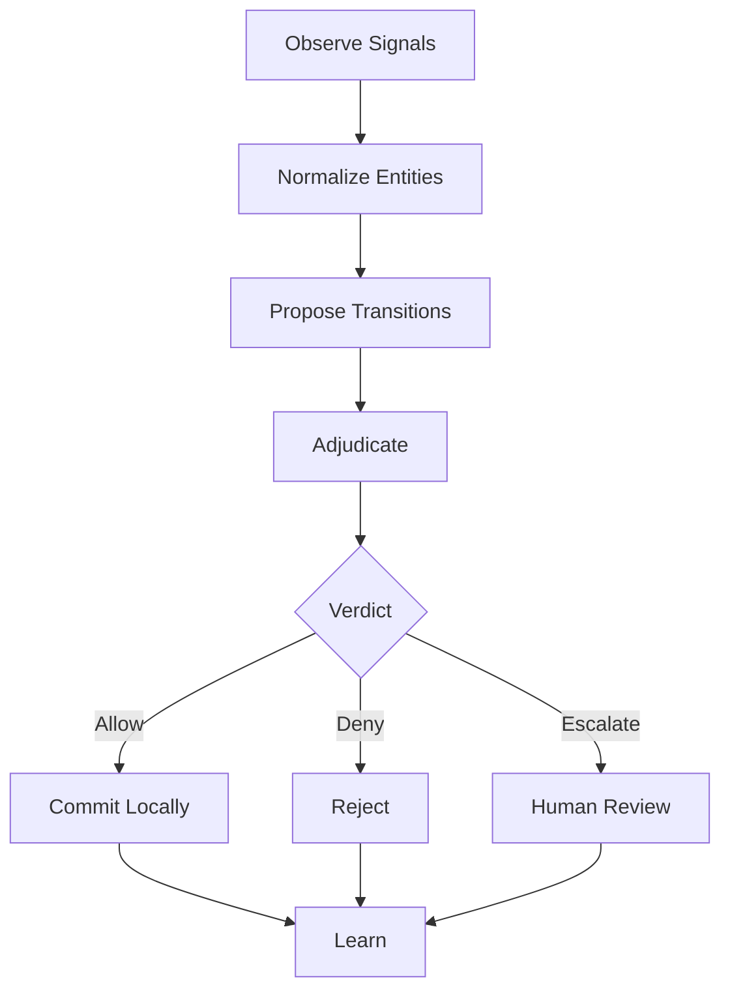

# WorldLoops

<p align="center">
  
</p>

Agents don't need more tools.\
They need a world to act in.

Because uncontrolled agents are too risky, and supervised agents make humans the bottleneck.

WorldLoops is an executable world layer for OpenClaw that turns scattered work signals into governed state transitions.

It can inspect signals from tools like Gmail, Calendar, and Slack, detect unresolved open loops, propose what should happen next, and keep execution safe with `externalWrite: false`.

WorldLoops is not a chatbot.\
It is not a todo app.\
It is not another trigger-based automation.

It is a small world model for agentic work execution.

From scattered signals to governed execution.

---

Most agents answer from a snapshot.\
WorldLoops manages open loops as state.

Most assistants wait for the user to ask, "What did I miss?"\
WorldLoops is designed to inspect work signals, identify unresolved responsibilities, and keep track of which loops are still open and what state they are in.

From snapshot answers to stateful open-loop management.\
Not just "What did I miss?" — but "What loops are still open, and what state are they in?"

---

## Status

| Item | Status |
|---|---|
| Public ClawHub skill | ✓ |
| Latest release | `v1.0.0` |
| Clean install tested | ✓ |
| Gmail live validation | passed |
| Google Calendar live validation | passed |
| Slack live validation | passed |
| `externalWrite: false` confirmed | ✓ |
| Safe-by-default execution posture | ✓ |
| Open-loop detector blind spot fix | ✓ v0.2.6 |
| Notification preference runtime | ✓ v0.2.7 |
| Proactive discovery runtime (local) | ✓ v0.2.7 |
| Scheduled daily brief (local) | ✓ v0.2.7 |

---

## Why WorldLoops Exists

Most agents are tool-first. They can call APIs, summarize messages, draft replies, and trigger workflows. But real work does not happen as isolated tool calls.

Real work lives across emails, calendars, Slack messages, project updates, approvals, delays, promises, missing responses, and unresolved decisions. That is where open loops appear.

| | |
|---|---|
| Traditional automation | sees events |
| WorldLoops | sees state |
| Traditional agents | call tools |
| WorldLoops | proposes transitions |
| Traditional workflows | execute |
| WorldLoops | adjudicates before commit |

---

## The Agent Trust Gap

Today's agents are trapped between two bad options.

Give them write access, and they may act too freely.

Turn write access off, and they become passive copilots that need a human sitting beside them.

That is not autonomy. That is supervision at machine speed. The agent never gets tired. The human does.

This is the agent trust gap.

WorldLoops exists to close that gap.

It separates reasoning from execution, proposal from commit, and approval from external action.

Agents can keep working across signals, loops, and responsibilities. Humans stay in control without becoming the bottleneck. And external writes remain disabled by default with `externalWrite: false`.

The goal is not to make agents powerless.\
The goal is to make agent execution governable.

---

## Promptless by Design

Most assistants wait for a question. WorldLoops watches the world.

WorldLoops is not designed to wait for the user to ask, "What did I miss?" It can inspect events, snapshots, and work signals as they arrive, then propose unresolved loops before the user manually asks.

A user prompt may start a brief. But the core unit of WorldLoops is not a prompt. It is a signal.

An email arrives. A Slack message creates an obligation. A calendar event implies preparation. A project update changes responsibility.

WorldLoops observes those signals, normalizes them into world entities, and proposes governed transitions.

The user does not need to discover every loop manually. WorldLoops makes the loop visible.

---

## Notification Preferences

> **Runtime MVP — v0.2.7**

WorldLoops stores notification preferences locally in `.worldloops/notification_prefs.json`. Users control time, frequency, severity thresholds, and quiet hours.

```bash
# Create default preferences file
npm run notifications:init

# View current preferences
npm run notifications:show

# Set a preference by dot-path
npm run notifications:set -- dailyBrief.time 09:00
npm run notifications:set -- proactiveDiscovery.scanIntervalMinutes 60
npm run notifications:set -- proactiveDiscovery.minSeverity high
npm run notifications:set -- quietHours.enabled true
npm run notifications:set -- quietHours.start 21:00
npm run notifications:set -- quietHours.end 08:00
```

Supported preference fields:

| Field | Default | Description |
|---|---|---|
| `dailyBrief.enabled` | `true` | Enable daily brief |
| `dailyBrief.time` | `09:00` | Scheduled brief time (HH:MM) |
| `dailyBrief.timezone` | `UTC` | Timezone label |
| `proactiveDiscovery.enabled` | `false` | Enable proactive discovery |
| `proactiveDiscovery.scanIntervalMinutes` | `30` | Scan interval in minutes |
| `proactiveDiscovery.minSeverity` | `medium` | Minimum severity to surface |
| `quietHours.enabled` | `false` | Enable quiet hours |
| `quietHours.start` | `21:00` | Quiet period start |
| `quietHours.end` | `08:00` | Quiet period end |
| `eventAlerts.enabled` | `false` | Enable event alerts |
| `channels.cli` | `true` | CLI output channel |

This release does not auto-install background scheduling. Users may connect `brief:daily` to cron or launchd manually if they choose.

---

## Proactive Discovery

> **Runtime MVP — v0.2.7**

`discovery:run` reads notification preferences and surfaces only candidates that match the configured severity threshold. It applies duplicate suppression using `.worldloops/notification_state.json` to prevent repeated surfacing of the same candidate across runs.

```bash
npm run discovery:run -- \
  --gmail-event scripts/fixtures/openclaw-gmail-webhook.json \
  --gog-gmail scripts/fixtures/gog-gmail-messages.json
```

When a signal arrives, WorldLoops inspects it for unresolved state and surfaces open-loop candidates proactively. Each candidate is presented with suggested actions:

- **Review** — inspect the candidate and decide
- **Snooze** — defer for a set period
- **Dismiss** — mark as not actionable
- **Mark handled** — record that the loop was resolved

Safe-by-default: no external writes. Proactive discovery proposes — it does not act.

---

## Scheduled Daily Brief

> **Runtime MVP — v0.2.7**

`brief:daily` reads notification preferences and produces a daily brief output. It respects quiet hours and outputs JSON with `safety.externalWrite=false`.

```bash
npm run brief:daily -- \
  --gmail-event scripts/fixtures/openclaw-gmail-webhook.json \
  --calendar-event scripts/fixtures/openclaw-calendar-events.json
```

A daily brief includes:

- important open loops requiring action
- uncertain threads needing inspection
- upcoming meetings and preparation items
- required user decisions
- signals that arrived since the last brief

High-severity candidates can be surfaced before the scheduled brief time by running `discovery:run` separately. Quiet hours suppress non-critical notifications.

The brief is a proposal, not an execution. No external writes. User approval is required for any resulting action.

**Connecting to a schedule (optional):** This release does not auto-install cron or launchd. To run the daily brief automatically, add an entry to your crontab:

```
0 9 * * * cd ~/.openclaw/workspace/skills/worldloops && npm run brief:daily >> ~/.worldloops/brief.log 2>&1
```

To run a brief manually right now (using the reconcile API flow):

```bash
npm run brief:reconcile -- \
  --gmail-event scripts/fixtures/openclaw-gmail-webhook.json \
  --calendar-event scripts/fixtures/openclaw-calendar-events.json
```

### Persistent open-loop state

`brief:reconcile` does more than print a snapshot brief. When proposal candidates are returned, WorldLoops persists them as local open-loop state in `.worldloops/open_loop_states.json`.

Example:

    npm run brief:reconcile -- --gmail-event scripts/fixtures/openclaw-gmail-webhook.json --calendar-event scripts/fixtures/openclaw-calendar-events.json --gog-gmail scripts/fixtures/gog-gmail-messages.json --gog-calendar scripts/fixtures/gog-calendar-events.json

List persisted loops (compact table):

    npm run loop:list

List persisted loops (full JSON):

    npm run loop:list -- --json

Filter loops by status:

    npm run loop:list -- --status todo
    npm run loop:list -- --status doing
    npm run loop:list -- --status done
    npm run loop:list -- --status snoozed
    npm run loop:list -- --status escalated

Filter loops by severity:

    npm run loop:list -- --severity low
    npm run loop:list -- --severity medium
    npm run loop:list -- --severity high
    npm run loop:list -- --severity critical

Combine filters (AND semantics):

    npm run loop:list -- --status todo --severity high

Filters work with --json:

    npm run loop:list -- --status todo --json
    npm run loop:list -- --severity high --json
    npm run loop:list -- --status escalated --severity critical --json

If no loops match, the output is a friendly empty state:

    No open loops matched the selected filters.

For --json with no matches:

    { "ok": true, "loops": [], "filters": { "status": "todo", "severity": "high" }, "count": 0, ... }

Invalid filter values fail safely with a structured JSON error.

Move a loop through state:

    npm run loop:transition -- <loopId> doing "started local follow-up"
    npm run loop:transition -- <loopId> done "completed locally"

Open loops currently support:

    todo -> doing -> done
    todo -> snoozed
    todo -> escalated

All state is local. These commands preserve `externalWrite: false`; they do not write to Gmail, Calendar, Slack, GitHub, or any external system.

### Capability-scoped execution boundary

WorldLoops exposes its safe-by-default capability boundary through:

    npm run capability:show

The boundary explicitly separates allowed local/read-only capabilities from denied external-write capabilities.

Allowed examples:

- read input signals
- generate briefs
- generate proposal candidates
- persist local transition receipts
- persist local open-loop state
- transition local open-loop state

Denied examples:

- send email
- create email drafts
- send Slack messages
- create calendar events
- modify GitHub
- write to any external system

All external-write capabilities remain denied with `externalWrite:false`.

### Severity-based adjudication policy

WorldLoops maps loop severity to a local adjudication action:

    low      -> track
    medium   -> propose
    high     -> require_approval
    critical -> escalate

The policy is applied when proposal candidates are persisted as open-loop state. Each persisted loop includes an adjudication result while preserving `externalWrite:false`.

### Stuck-loop timeout reconciliation

WorldLoops can reconcile persisted open loops and apply local timeout policy:

    npm run loop:reconcile

Current policy:

    todo older than 48 hours -> escalated
    doing older than 24 hours -> escalated
    snoozed past dueAt -> todo
    high/critical overdue -> escalated

`loop:reconcile` only transitions local open-loop state. It preserves `externalWrite:false` and does not write to Gmail, Calendar, Slack, GitHub, or any external system.

### Narrowed source signals

When proposal candidates are persisted as open-loop state, WorldLoops now stores only source-relevant signals instead of copying every observed signal into every loop.

Current narrowing policy:

    candidate.source match -> keep same-source signals
    no same-source match -> keep first observed signal as fallback
    no signals -> keep empty sourceSignals

This keeps local open-loop state smaller and easier to inspect while preserving `externalWrite:false`.

### Open loop summary

WorldLoops can summarize current open loop state counts:

    npm run loop:summary

Example output:

    Open loop summary

    total: 12

    by status:
      todo: 6
      doing: 2
      done: 3
      snoozed: 0
      escalated: 1

    by severity:
      low: 0
      medium: 8
      high: 3
      critical: 1

For structured JSON output:

    npm run loop:summary -- --json

The JSON output includes `summary.total`, `summary.byStatus`, `summary.bySeverity`, and the capability boundary with `externalWrite: false`.

### Focused loop inspection

WorldLoops can show one persisted open loop in detail:

    npm run loop:show -- <loopId>

The focused view includes:

- id
- canonicalKey
- title
- status
- severity
- adjudication
- sourceSignals
- history
- safety.externalWrite
- capabilityBoundary

If the loop ID is missing or not found, WorldLoops returns a safe JSON error and available loop IDs for inspection.

---

## What Is an Open Loop?

An open loop is a work signal that implies unfinished responsibility. It is not just a task. It is a state that has not been resolved.

Examples:

- an email that requires a reply
- a Slack message asking someone to review something
- a meeting that implies preparation
- a GitHub pull request waiting for decision
- a project update that creates follow-up work
- a commitment made in one app but not reflected anywhere else

WorldLoops detects these loops, groups related signals, and proposes what should happen next.

---

## What WorldLoops Does

```
Observe → Normalize → Propose → Adjudicate → Commit → Learn
```

WorldLoops can:

- observe work signals from connected sources
- normalize scattered signals into consistent entities
- detect unresolved open loops
- group related signals across tools
- propose state transitions
- separate approval from execution
- produce safe action plans
- keep external writes disabled by default
- preserve an audit trail of what was proposed, approved, rejected, or deferred

WorldLoops does not ask an agent to "just do things." It gives the agent a world where actions can be proposed, judged, approved, committed, and audited.

---

## Install from ClawHub

WorldLoops is available as a public OpenClaw skill on ClawHub.

```
clawhub install worldloops
```

WorldLoops installs as a workspace skill:

```
~/.openclaw/workspace/skills/worldloops
```

This is expected. Bundled skills ship with OpenClaw itself. WorldLoops is a public ClawHub skill installed into your local OpenClaw workspace.

---

## Quick Start

Install and build:

```bash
npm install
npm run build
```

Run a reconciliation brief using included fixtures:

```bash
npm run brief:reconcile -- \
  --gmail-event scripts/fixtures/openclaw-gmail-webhook.json \
  --calendar-event scripts/fixtures/openclaw-calendar-events.json
```

Expected result:

- open loops detected
- related signals grouped
- safe proposals generated
- `externalWrite: false`

Additional fixture flags are also available (`--gog-gmail`, `--gog-calendar`, `--message-read`) for multi-source reconciliation.

---

## Safety Posture

WorldLoops is safe by default. It does not give agents uncontrolled write access to your tools. Every proposed transition is governed before it becomes an action.

```
Proposal is not execution.
Approval is not external write.
Commit is local unless explicitly connected.
```

Current public skill posture:

- `externalWrite: false`
- no uncontrolled external side effects
- local-first validation
- approval-aware transition flow
- structured output for auditability
- designed for human-in-the-loop execution

WorldLoops is built for the space between powerless copilots and reckless autonomous agents. It lets agents continue reasoning and preparing the next move without silently mutating the outside world.

---

## Architecture

### The Six-Stage Execution Loop

**Observe** — Work signals arrive from connected sources: email, calendar, Slack, project tools. WorldLoops ingests them as normalized events.

**Normalize** — Signals are converted into a common entity shape regardless of source. An email thread, a Slack mention, and a calendar block can all resolve to the same underlying work obligation.

**Propose** — WorldLoops identifies unresolved states and proposes what transition should happen. A proposal is not an action. It is a candidate for review.

**Adjudicate** — Each proposal is evaluated against governance rules, prior decisions, and configured policies. The adjudicator produces a verdict: allow, deny, or escalate.

**Commit** — Approved transitions are committed locally. External writes remain disabled unless explicitly configured.

**Learn** — Verdicts, approvals, rejections, and deferrals are recorded. The loop builds a decision history that informs future proposals.



---

## Example

A user receives:

- a Gmail message asking for a proposal update
- a Slack message saying "please review before tomorrow"
- a calendar event with no preparation task linked
- a project thread where the same topic is already being discussed

A normal assistant may summarize these. WorldLoops does something different.

It identifies that these are related signals around the same unresolved responsibility. Then it proposes a transition:

```json
{
  "entityType": "open_loop",
  "currentState": "detected",
  "proposedState": "needs_review",
  "reason": "Multiple related signals indicate an unresolved review obligation.",
  "externalWrite": false
}
```

No external action is taken. The loop becomes visible, reviewable, and governable.

---

## World-First Agents

Most agent systems start with tools. WorldLoops starts with the world.

A world is not a prompt. A world is not a tool list. A world is not a workflow diagram.

A world is a structured execution environment made of entities, states, transitions, constraints, verdicts, approvals, and audit trails.

This is the missing layer between LLM reasoning and real organizational execution.

Without a world, an agent can talk.\
With tools, an agent can act.\
With a world, an agent can act safely.

---

## What WorldLoops Is / Is Not

**WorldLoops is:**

- an executable world layer
- an OpenClaw skill
- an open-loop detection system
- a governed transition proposal engine
- a safe-by-default agent execution scaffold
- a local-first way to make agent work visible, reviewable, and governable

**WorldLoops is not:**

- a chatbot
- a todo app
- a Zapier clone
- an uncontrolled automation runner
- a system that lets agents freely write to external tools
- a replacement for human judgment

WorldLoops does not remove humans from the loop. It removes humans from being the bottleneck.

---

## OpenClaw Skill

WorldLoops is published as a public ClawHub skill for OpenClaw. It installs into the local OpenClaw workspace and runs as an external skill, not a bundled core skill.

```
clawhub install worldloops
```

This allows WorldLoops to evolve independently while remaining compatible with the OpenClaw skill model.

---

## Environment

By default, WorldLoops uses the public API:

```
https://api.worldloops.ai
```

You do not need to set `WORLDLOOPS_API_BASE_URL` for the default demo flow.

To use a different backend, override it:

```
WORLDLOOPS_API_BASE_URL=https://your-worldloops-api.example.com
```

Optional:

```
WORLDLOOPS_API_KEY=your_api_key
```

---

## Public Boundary

This public repository contains:

- OpenClaw skill metadata
- public signal adapters
- input/output schemas
- safe examples and fixtures
- a thin API wrapper for the WorldLoops brief API

It does not contain the private WorldLoops reasoning engine.

**Public:** signal types, adapter examples, schemas, fixtures, API wrapper

**Private:** open-loop detection logic, cross-source scoring, canonicalization, proposal generation internals, learning and governance internals

---

## Roadmap

Added in v0.2.7:

- notification preference runtime (local `.worldloops/notification_prefs.json`)
- `notifications:init`, `notifications:show`, `notifications:set` CLI commands
- `brief:daily` — user-scheduled daily brief with quiet hours support
- `discovery:run` — severity-filtered proactive discovery with duplicate suppression
- notification state (`.worldloops/notification_state.json`) for dedup across runs

Added in v0.2.6:

- open-loop detector blind spot fix (Re:/Fwd: external request threads)
- proactive discovery direction
- scheduled daily brief direction
- improved ClawHub/OpenClaw metadata discoverability

## v1.0.0 — Safe Execution Contracts

WorldLoops now turns local execution plans into safe execution contracts.

The core principles remain:

Proposal ≠ Execution\
Approval ≠ Execution\
Plan ≠ Execution\
Contract ≠ External Write

A planned execution plan can become a local safe execution contract, but the contract does not execute anything. It defines the boundary, preconditions, required approvals, rollback availability, and audit readiness before any future execution layer is considered.

### Commands

```bash
npm run contract:create -- <plan-id>          # create contract from planned execution plan
npm run contract:create -- <plan-id> --json   # JSON output
npm run contract:list                          # list all execution contracts (human-readable)
npm run contract:list -- --json               # structured JSON list
npm run contract:show -- <contract-id>        # show contract detail (human-readable)
npm run contract:show -- <contract-id> --json # structured JSON detail
npm run contract:review                       # execution contract review summary
npm run contract:review -- --json             # structured JSON review
```

### Contract status

- `draft` — contract defined locally, no execution has occurred

### Execution boundary

All contracts carry an `executionBoundary` that explicitly lists denied capabilities:

- `sendEmail`
- `createEmailDraft`
- `sendSlackMessage`
- `createCalendarEvent`
- `modifyGitHub`
- `writeExternalSystem`

`allowedBoundary` is `local_commit`. `externalWrite` is `false`.

### Execution contract storage

Contracts are stored locally under `.worldloops/execution_contracts.json`. `WORLDLOOPS_DIR` overrides the storage root. No external writes.

### The safe pre-execution chain

Signals become loops.\
Loops become proposals.\
Proposals become decisions.\
Decisions become plans.\
Plans become contracts.\
Execution remains governed.

### Intentionally deferred

- Actual execution
- Rollback mechanism
- Whitelist auto-approval
- External writes
- External DB or state adapter
- Connector expansion
- Domain-specific contracts
- `loop:update`

---

## v0.9.0 — Execution Plan Preview

WorldLoops now turns approved local proposals into local execution plans.

The core principles remain:

**Proposal ≠ Execution**\
**Approval ≠ Execution**\
**Plan ≠ Execution**

An approved proposal can become a plan, but the plan does not execute anything. It only creates a local, inspectable, auditable preview of what execution would require.

### Commands

```bash
npm run plan:create -- <proposal-id>
npm run plan:create -- <proposal-id> --json
npm run plan:list
npm run plan:list -- --json
npm run plan:show -- <plan-id>
npm run plan:show -- <plan-id> --json
npm run plan:review
npm run plan:review -- --json
```

### plan:create

Converts an approved proposal into a local execution plan preview. Only approved proposals can be converted. Proposed, rejected, snoozed, and escalated proposals are refused with a structured error.

Returns `PROPOSAL_NOT_FOUND` if the proposal id does not exist.
Returns `PROPOSAL_NOT_APPROVED` if the proposal status is not `approved`.

Generated steps are derived generically from the proposal's `templateId` and `category`. Minimum steps:

1. Review approved proposal (`review`)
2. Check capability boundary (`boundary_check`)
3. Prepare dry-run preview (`prepare`)
4. Mark receipt-ready (`receipt_ready`)

High-risk and critical-risk proposals receive an additional `dry_run` validation step before `receipt_ready`.

All steps carry `externalWrite: false`.

### plan:list

Lists all local execution plans. Human-readable by default, JSON with `--json`.

Empty state outputs: `No execution plans found.`

### plan:show

Shows full detail for a single execution plan including all steps. Human-readable by default, JSON with `--json`.

Returns `EXECUTION_PLAN_NOT_FOUND` with `availablePlanIds` if not found.

### plan:review

Summarizes all local execution plans: total count, count by status, high-risk plans, and suggested focus. Human-readable by default, JSON with `--json`.

Empty state JSON:

```json
{
  "ok": true,
  "source": "worldloops.local",
  "review": {
    "total": 0,
    "byStatus": { "planned": 0 },
    "highRiskPlans": [],
    "suggestedFocus": null
  },
  "safety": { "externalWrite": false }
}
```

### Execution plan storage

Execution plans are stored locally under:

    .worldloops/execution_plans.json

`WORLDLOOPS_DIR` overrides the storage root. No external writes.

### Safety boundary

- `externalWrite: false` preserved
- No external writes
- Plans do not execute proposal contents
- All state is local
- Plan ≠ Execution

This release prepares WorldLoops for a future safe execution contract without crossing into external writes.

### Intentionally deferred

- Actual execution
- Rollback mechanism
- Whitelist auto-approval
- External writes
- External DB or state adapter
- Connector expansion
- Domain-specific execution plans
- `loop:update`

---

## v0.8.0 — Proposal Review Decisions

WorldLoops now turns local proposals into reviewable decisions.

The core principles remain:

**Proposal ≠ Execution**\
**Approval ≠ Execution**

A proposal can be approved, rejected, snoozed, or escalated, but none of these decisions execute an external action. They only update local proposal state and create local decision receipts.

### Commands

```bash
npm run proposal:decide -- <proposal-id> approve
npm run proposal:decide -- <proposal-id> reject
npm run proposal:decide -- <proposal-id> snooze
npm run proposal:decide -- <proposal-id> escalate
npm run proposal:review
npm run proposal:review -- --json
npm run proposal:receipts
npm run proposal:receipts -- --json
```

### Decision statuses

| Status | Meaning |
|---|---|
| `proposed` | Initial state — awaiting a decision |
| `approved` | Approved by a reviewer — does not execute anything |
| `rejected` | Rejected — proposal remains locally, not deleted |
| `snoozed` | Deferred — can be re-proposed with `repropose` |
| `escalated` | Escalated — can be re-proposed with `repropose` |

Valid transitions:

```
proposed  → approved
proposed  → rejected
proposed  → snoozed
proposed  → escalated
snoozed   → proposed  (decision: repropose)
escalated → proposed  (decision: repropose)
```

Terminal states: `approved` and `rejected` cannot be transitioned in v0.8.0.

### Decision receipts

Decision receipts are stored locally under `.worldloops/proposal_decision_receipts.json`. Each receipt captures:

- receipt id
- proposal id
- template id
- decision
- previous status
- new status
- actor (`worldloops.local`)
- note (optional)
- `boundaryCrossed: local_commit`
- `externalWrite: false`
- `createdAt`
- `source: worldloops.local`

Receipts are local-only. They never imply external execution.

### Safety boundary

- `externalWrite: false` preserved
- No external writes
- Proposals remain stored locally under `.worldloops/proposals.json`
- Approval does not execute proposal contents
- Rejection does not delete proposals
- All state is local

This release strengthens the Adjudicate layer: agents can propose, humans can decide, and execution remains separate.

### Intentionally deferred

- Actual execution after approval
- Rollback mechanism
- Whitelist auto-approval
- External writes
- External DB or state adapter
- Connector expansion
- Domain-specific templates or decisions
- `loop:update`

---

## v0.7.0 — Proposal Templates Foundation

> **Minor release**

WorldLoops now introduces generic proposal templates for common agent intentions: file writes, API calls, state transitions, human review, notification drafts, and escalation.

The core principle remains:

**Proposal ≠ Execution**

Templates do not execute actions. They standardize agent intent into local, reviewable proposal objects before any commit or external write is considered.

### Initial templates

| Template ID | Category | Risk Level | Description |
|---|---|---|---|
| `file-write` | file_system | medium | Propose a file write or modification — does not write any file |
| `api-call` | external_api | high | Propose an API call — does not call any API |
| `state-transition` | state_management | medium | Propose a state change (e.g. todo → doing) — does not transition anything |
| `human-review` | review | low | Propose human inspection before any commit |
| `notification-draft` | communication | medium | Propose a message draft — does not send any message |
| `escalation` | escalation | high | Propose escalation to a human owner — does not execute the escalation |

All templates include: `externalWrite: false`, `requiredReview: true`, suggested checks, and example use cases.

### Commands

```bash
npm run proposal:templates                         # human-readable template list
npm run proposal:templates -- --json               # structured JSON list

npm run proposal:create -- <template-id>           # create proposal (human-readable)
npm run proposal:create -- <template-id> --json    # create proposal (JSON)

npm run proposal:list                              # list local proposals (human-readable)
npm run proposal:list -- --json                    # list local proposals (JSON)

npm run proposal:show -- <proposal-id>             # show proposal detail (human-readable)
npm run proposal:show -- <proposal-id> --json      # show proposal detail (JSON)
```

### Local-only storage

All proposals are stored locally under `.worldloops/proposals.json`. No external writes. `externalWrite: false` is preserved.

### Example use cases

SEO audits, GEO content updates, GitHub PR reviews, sitemap updates, marketing workflows, and enterprise operations can all use this proposal pattern — but v0.7.0 keeps templates generic rather than domain-specific. Domain-specific templates are intentionally deferred.

### Intentionally deferred

- Rollback mechanism
- Whitelist auto-approval
- External writes
- External DB or state adapter
- Connector expansion
- Domain-specific templates (e.g. seo-link-check, sitemap-update)
- `loop:update`

---

## v0.6.0 — Loop Lifecycle UX

> **Minor release**

This release strengthens the loop lifecycle CLI with governed transition validation, human-readable loop inspection, a lifecycle review command, and clearer cross-session state persistence documentation. All commands remain local-only and preserve `externalWrite: false`.

### Cross-session state persistence

WorldLoops persists open-loop state locally to `.worldloops/open_loop_states.json`. This file survives agent restarts, shell session restarts, and machine reboots. Open loops that were detected in one session remain visible and actionable in a future session.

No external database or remote memory adapter is required. State is local-only. `externalWrite: false` is preserved across all commands.

To inspect persisted loops after a restart:

    npm run loop:list
    npm run loop:show -- <loopId>
    npm run loop:review

### loop:show — human-readable default

`loop:show` now outputs a human-readable view by default:

    npm run loop:show -- <loopId>

Shows: id, status, severity, source, owner, adjudication reason, related signals, suggested action, and externalWrite boundary.

For structured JSON (original format):

    npm run loop:show -- <loopId> --json

### loop:transition — governed state transitions

`loop:transition` now validates that a transition is permitted by the lifecycle graph before committing it.

Valid transitions:

    todo      → doing
    doing     → done
    doing     → snoozed
    doing     → escalated
    snoozed   → todo
    escalated → doing

Both the original positional format and a new `--to` flag are supported:

    npm run loop:transition -- <loopId> doing
    npm run loop:transition -- <loopId> --to doing

Invalid transitions fail safely with a structured JSON error:

    { "ok": false, "error": { "code": "INVALID_LOOP_TRANSITION", "allowedTransitions": ["doing"] }, ... }

Dry-run mode validates without committing:

    npm run loop:transition -- <loopId> --to doing --dry-run

Dry-run returns a `preview` of what would happen and does not write to local state.

### loop:review

New lifecycle summary command:

    npm run loop:review

Outputs:

- total loop count
- count by status
- high and critical severity loops (non-done)
- suggested focus (first active high/critical loop)
- externalWrite: false boundary reminder

For structured JSON:

    npm run loop:review -- --json

JSON output includes `review.total`, `review.byStatus`, `review.highSeverityLoops`, `review.suggestedFocus`, and the capability boundary with `externalWrite: false`.

---

## v0.5.0 — Loop Inspection UX

> **Minor release** — bundles v0.4.4, v0.4.5, and v0.4.6 into a single user-facing Loop Inspection UX milestone.

This release makes it meaningfully easier to inspect, filter, and summarize persisted open-loop state from the CLI. All commands remain local-only and preserve `externalWrite: false`.

### Compact loop list

`loop:list` now outputs a compact human-readable table by default:

    npm run loop:list

Columns: id, status, severity, title, source count, updatedAt.
An empty loop store shows a friendly `No open loops found.` message.

### loop:list --json

Restore full JSON output when needed:

    npm run loop:list -- --json

### loop:list --status \<status\>

Filter the compact list (or JSON output) by loop status:

    npm run loop:list -- --status todo
    npm run loop:list -- --status doing
    npm run loop:list -- --status done
    npm run loop:list -- --status snoozed
    npm run loop:list -- --status escalated

### loop:list --severity \<severity\>

Filter by loop severity:

    npm run loop:list -- --severity low
    npm run loop:list -- --severity medium
    npm run loop:list -- --severity high
    npm run loop:list -- --severity critical

Filters combine with AND semantics and work with `--json`. No loops matched returns a friendly message or an empty `loops` array with a `filters` field. Invalid filter values fail safely with a structured JSON error.

### loop:summary

Summarize current open-loop state counts by status and severity:

    npm run loop:summary

Example output:

    Open loop summary

    total: 12

    by status:
      todo: 6
      doing: 2
      done: 3
      snoozed: 0
      escalated: 1

    by severity:
      low: 0
      medium: 8
      high: 3
      critical: 1

### loop:summary --json

Structured JSON output including `summary.total`, `summary.byStatus`, `summary.bySeverity`, and the capability boundary with `externalWrite: false`:

    npm run loop:summary -- --json

---

Added in v0.4.6:

- `loop:list -- --status <value>` — filter compact output by loop status
- `loop:list -- --severity <value>` — filter compact output by loop severity
- Filters combine with AND semantics (`--status todo --severity high`)
- Filters work with `--json`; filtered JSON output includes a `filters` field
- Friendly empty state when no loops match: `No open loops matched the selected filters.`
- Invalid filter values fail safely with a structured JSON error (`INVALID_STATUS_FILTER`, `INVALID_SEVERITY_FILTER`)

Added in v0.4.5:

- `loop:summary` — summarize open loop state counts by status and severity
- `loop:summary -- --json` — structured JSON output with capability boundary

Added in v0.4.4:

- `loop:list` now outputs a compact human-readable table by default (id, status, severity, title, source count, updatedAt)
- `loop:list -- --json` restores the previous full JSON output
- Empty loop list shows a friendly `No open loops found.` message

Added in v0.3.0:

- Transition receipts for auditable loop history (`.worldloops/transition_receipts.json`)
- `receipt:list` CLI command — inspect persisted receipts locally
- `TransitionReceipt` type with `boundaryCrossed`, `externalWrite: false`, and `redactions`
- Receipts generated automatically during `brief:reconcile` for each proposal candidate
- Persistent open-loop state management (`.worldloops/open_loop_states.json`)
- `loop:list` CLI command — inspect persisted open loops locally
- `loop:transition` CLI command — move loops through `todo`, `doing`, `done`, `snoozed`, and `escalated`
- Proposal candidates generated during `brief:reconcile` are persisted as local open-loop state
- Capability-scoped execution boundary with `capability:show`
- Severity-based adjudication policy for `low`, `medium`, `high`, and `critical` loops
- Stuck-loop timeout reconciliation with `loop:reconcile`

**Transition receipts** are small audit records that capture what signals were observed, what transition was proposed, what boundary was crossed, and why the loop stayed local. They let a reviewer reconstruct what happened in an open-loop transition without trusting the agent's narrative summary.

### v0.3.x — Auditable Open-Loop Runtime (continued)


---

## Links

- Website: https://worldloops.ai
- API: https://api.worldloops.ai
- ClawHub: worldloops
- Latest release: `v1.0.0`

---

## The Principle

The future of agents is not just better reasoning.

It is better worlds.

WorldLoops exists because enterprise agents need more than prompts, tools, and workflows.

They need executable worlds where responsibilities are visible, transitions are governed, and actions can be trusted.

Give agents a world, not just tools.

Close the loop.\
Keep the world safe.
